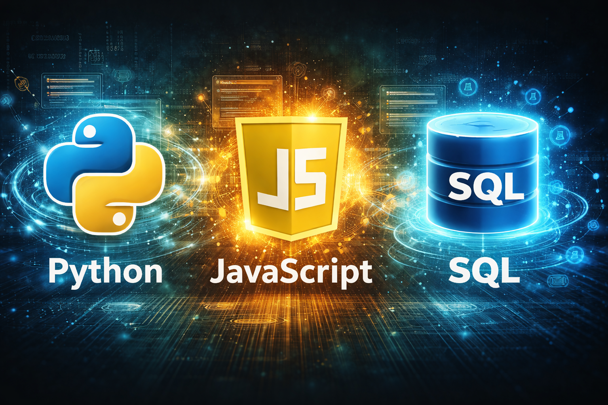

# 👋 Hi, I'm Kevin

  

💻 **Aspiring Software Developer** passionate about programming and continuous learning.
Currently focused on improving my skills in **Python, JavaScript, and SQL** while building practical projects.

---

## 🚀 About Me

* 🌱 Currently learning **Python, JavaScript, and SQL**
* 💻 Interested in **web development and databases**
* 📚 I enjoy learning by building **hands-on projects**
* 🎯 My goal is to become a **professional software developer**

---

## 🛠️ Languages and Tools

**Languages**

* Python
* JavaScript
* SQL

**Tools**

* Git
* GitHub
* VS Code

---

## 📊 What I'm Working On

* Building small projects to improve my programming skills
* Practicing **SQL queries and database design**
* Learning more about **web development with JavaScript**

---

## 🌐 Connect With Me

* LinkedIn: (your LinkedIn link)
* GitHub: (your GitHub profile)

---

⭐ Always open to learning new technologies and improving my development skills.

## GitHub Stats

